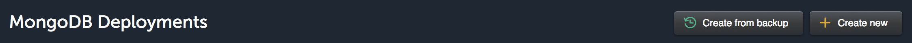
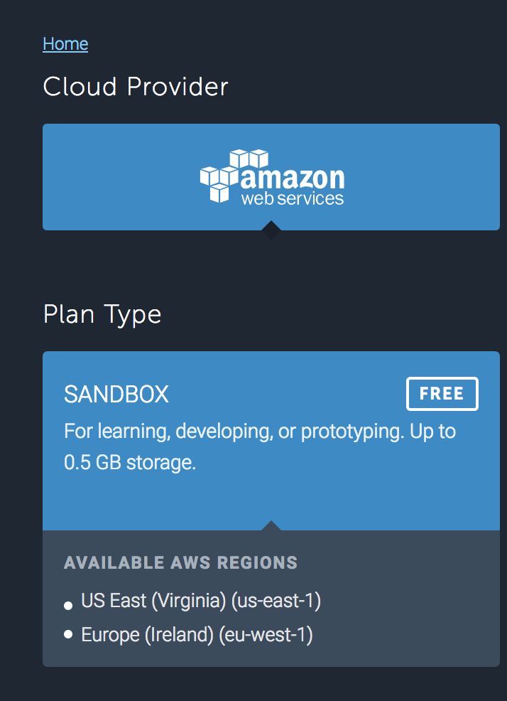
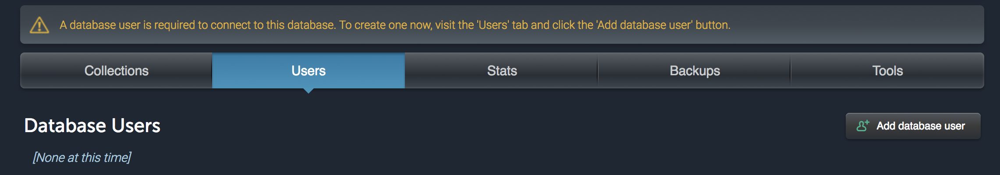
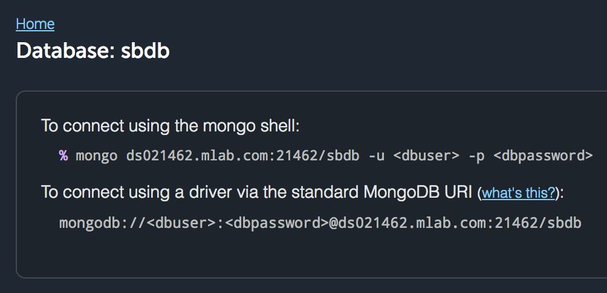

#  MLab Deployment and Mongoose Configuration

MLab (`mlab.com`) is a cloud-based database service that hosts a protected MongoDB that can be easily integrated with a Heroku application.

## Creating a MongoDB on MLab

1. Go to www.mlab.com and sign up or sign in.

2. Select a new AWS-hosted database with "Sandbox" as the Plan Type--it's free. Hit continue at the right bottom of the screen.
    

    
3. Choose a region and then hit continue.

4. Name your database and click Submit Order. You should be redirected in a couple moments to your mlab account homepage, [where your databases are listed](https://mlab.com/home). Click on the database you've just created.

5. Create a new user by clicking on the users tab and click on "Add database user." This is *not* the user with which you logged in to MLab. "User" refers to an app that has access to your database, and ***not your mlab account/username***.
    
    > Choose a username and password to connect to your database.

6. Copy the "To connect using a driver" MongoDB URI from the top of the Users page. Notice that the username and password from the last screen are reflected in the MongoDB URI.

    
    > You [can now see your mlab-hosted DBs here](https://mlab.com/home). Click on one of your databases and you should see a MongoDB URI like this: `https://mlab.com/databases/<your_database_name>`.


## Heroku and Node Set Up

Once we've added MLab, we only have one step left for a fully functioning app! We still need to let our Node app know *when* to use MLab as our database, and when to use our local DB.

Node's environment variables are stored in properties of `process.env`, aka `process.env.SOME_ENVIRONMENT_VARIABLE`. Environment variables tend to be ALL_CAPS_SNAKE_CASE by convention, the same convention for constants.

A built-in environment variable, `NODE_ENV` available under `process.env.NODE_ENV`. When a node app is deployed to Heroku, Heroku automagically sets the `NODE_ENV` variable is set as `"production"`.

The code below is stating that we should use the MLab URI (in other words, the link that connects us to the MLab database) when in production, and the local db all other times.

1. In your node's app `db/connection.js` file, or wherever you have `mongoose.connect()` are add the following...

    ```js
    if (process.env.NODE_ENV == "production") {
      mongoose.connect(process.env.MLAB_URL)
    } else {
      mongoose.connect("mongodb://localhost/whenpresident");
    }
    ```

    Then, add, commit, and push to your heroku remote.


2. Set the URL as an environment variable called `MLAB_URL` using `heroku config:set` as below, filling in the username and password you just created on the "Users" page.


    For example...

    ```sh
    $ heroku config:set MLAB_URL=mongodb://<your_db_login>:<your_db_password>@ds015760.mlab.com:15760/<yourappname>
    ```

3. `$ heroku run node db/seed.js`
4. `$ heroku open`
